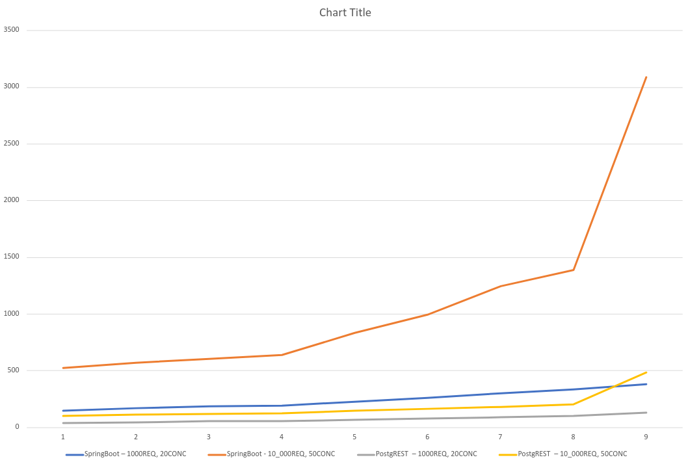

This is A FORK OF "compose-postgrest"
=================

Initially it didn't have the Spring Boot app, now the docker-compose also contains the "spring-data-rest" app that implements the "city" endpoint.

You can use the following commands to test the overall performance of the PostgREST and Spring Boot Data Rest.


```

# 10k requests, 50 concurrent calls, find all the cities with country code on Spring Boot App
ab -n 10000 -c 50 "http://172.0.0.1:9090/city/search/findByCountrycode?countrycode=TUR"

# 10k requests, 50 concurrent calls, find all the cities with country code on PostgREST
ab -n 10000 -c 50 "http://172.0.0.1:3000/city?countrycode=eq.TUR"

# 100 requests, 10 concurrent calls, find all the cities on Spring Boot App
ab -n 100 -c 10 "http://172.0.0.1:9090/city/search/findByPopulationGreaterThanEqual?population=1"

# 100 requests, 10 concurrent calls, find all the cities on PostgREST
ab -n 100 -c 10 "http://172.0.0.1:3000/city?population=gte.1"
```


Here are some results to compare.

```
Find all the cities
SpringBoot-1000REQ/20CONC, SpringBoot-10_000REQ/50CONC, PostgREST–1000REQ/20CONC, PostgREST–10_000REQ/50CONC
147	524	39	100
168	569	46	111
186	607	53	120
194	640	55	126
227	836	67	145
262	995	75	161
299	1248	87	181
337	1387	98	201
384	3091	131	482
```



"compose-postgrest"
=================

[Postgres](https://www.postgresql.org/), [PostgREST](https://github.com/begriffs/postgrest), and [Swagger UI](https://github.com/swagger-api/swagger-ui) conveniently wrapped up with docker-compose.

Place SQL into the `initdb` folder, get REST! 
Includes [world sample database](http://pgfoundry.org/projects/dbsamples/).

Contains a simple front-end  demo application.

Architecture
------------


Usage
-----

**Start the containers**

`docker-compose up -d`

**Tearing down the containers**

`docker-compose down --remove-orphans -v`

**Demo Application**

Located at [http://localhost](http://localhost)

**Postgrest**

Located at [http://localhost:3000](http://localhost:3000)

Try things like:
* [http://localhost:3000/city](http://localhost:3000/test)
* [http://localhost:3000/country](http://localhost:3000/country)
* [http://localhost:3000/countrylanguage](http://localhost:3000/countrylanguage)
* [http://localhost:3000/city?name=eq.Denver](http://localhost:3000/city?name=eq.Denver)
* [http://localhost:3000/city?population=gte.5000000](http://localhost:3000/city?population=gte.5000000)
* [http://localhost:3000/city?district=like.*Island](http://localhost:3000/city?district=like.*Island)
* [http://localhost:3000/city?district=like.*Island&population=lt.1000&select=id,name](http://localhost:3000/city?district=like.*Island&population=lt.1000&select=id,name)

**Swagger UI**

Located at [http://localhost:8080](http://localhost:8080)