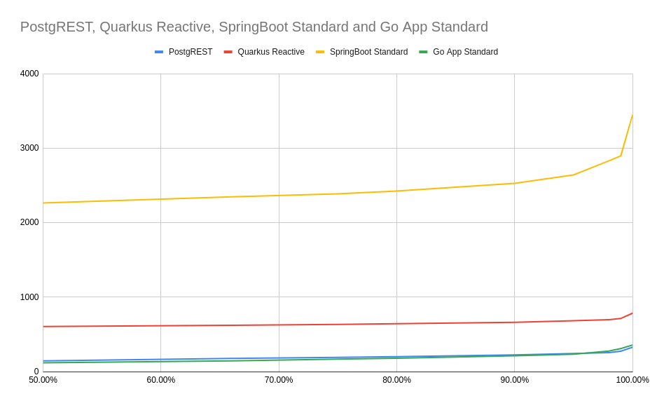
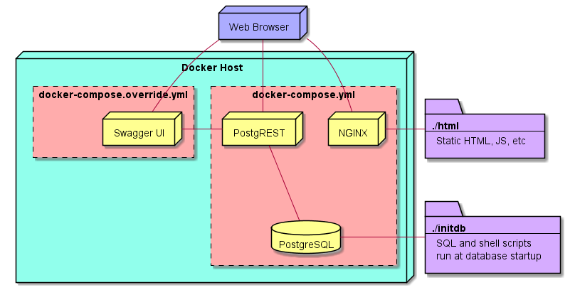

This is A FORK OF "compose-postgrest"
=================

Initially it didn't have the Spring Boot app, now the docker-compose also contains the "spring-data-rest" app that implements the "city" endpoint.

You can use the following commands to test the overall performance of the PostgREST and Spring Boot Data Rest.


```

# 10k requests, 50 concurrent calls, find all the cities with country code on Spring Boot App
ab -n 10000 -c 50 "http://172.0.0.1:9090/city/search/findByCountrycode?countrycode=TUR"

# 10k requests, 50 concurrent calls, find all the cities with country code on PostgREST
ab -n 10000 -c 50 "http://172.0.0.1:3000/city?countrycode=eq.TUR"

# 100 requests, 10 concurrent calls, find all the cities on Spring Boot App
ab -n 100 -c 10 "http://172.0.0.1:9090/city/search/findByPopulationGreaterThanEqual?population=1"

# 100 requests, 10 concurrent calls, find all the cities on PostgREST
ab -n 100 -c 10 "http://172.0.0.1:3000/city?population=gte.1"
```


Here are some results to compare.

```
Request % / ms - Find all the cities
'PostgREST'	'Quarkus-Reactive'	'SpringBoot-Standard'	'Go-App'
50.00%	144	607	2265	119
66.00%	178	622	2349	146
75.00%	191	634	2388	168
80.00%	202	643	2425	181
90.00%	224	664	2529	213
95.00%	243	683	2643	234
98.00%	256	698	2832	277
99.00%	274	714	2900	309
100.00%	329	785	3450	358
```



```
CPU USAGE (%)
'SpringBoot-Data-Rest'	'Quarkus-Reactive-Native'	'Go-App'	'PostgREST'
34.92	23.06	38.07	40.45
95.51	37.22	79.29	81.45
95.74	35.22	81.42	82.16
94.51	36.5	73.54	82.12
94.5	37		36.59
94.5	37.66		
95  	38.25		
94.5	37.06		
95.98	37.09		
93.77	36.63		
92.48	37.38		
93.27	36.21		
94  	37.25		
95.75	36.72		
95.74	22.56		
94.01			
94.5			
91.5			
94.49			
93			
95.51			
93.48			
94			
93.48			
95.25			
95.75			
94.75			
94.5			
94.49			
94.5			
94.26			
95			
93.98			
95			
94.75			
95.26			
94.99			
95			
95.5			
95.25			
94.75			
96.24			
93.52			
94.99			
94.49			
94.76			
96.25			
94.5			
94.75			
95.76			
95.23			
95.49			
95.01			
95.49			
95.25			
95.49			
95.01			
96.25			
94.99			
94.75			
76.94			
10.83			
```


```
MEMORY USAGE (%)
'SpringBoot-Data-Rest'	'Quarkus-Reactive-Native'	'Go-App'	'PostgREST'
35.44	3.5 	0.4	0.26
35.44	3.66	0.4	0.48
35.44	3.79	0.4	0.63
35.44	3.51	0.4	0.61
35.44	3.68		0.6
35.44	3.83		
35.44	3.59		
35.44	3.75		
35.44	3.45		
35.44	3.59		
35.44	3.75		
35.44	3.54		
35.44	3.68		
35.44	3.77		
35.44	3.47		
35.44			
35.44			
35.44			
35.44			
35.44			
35.44			
35.44			
35.45			
35.47			
35.48			
35.48			
35.5			
35.51			
35.52			
35.52			
35.53			
35.57			
35.59			
35.6			
35.61			
35.61			
35.61			
35.61			
35.65			
35.67			
35.7			
35.71			
35.71			
35.71			
35.72			
35.72			
35.72			
35.73			
35.73			
35.74			
35.74			
35.74			
35.75			
35.76			
35.76			
35.76			
35.76			
35.77			
```


"compose-postgrest"
=================

[Postgres](https://www.postgresql.org/), [PostgREST](https://github.com/begriffs/postgrest), and [Swagger UI](https://github.com/swagger-api/swagger-ui) conveniently wrapped up with docker-compose.

Place SQL into the `initdb` folder, get REST! 
Includes [world sample database](http://pgfoundry.org/projects/dbsamples/).

Contains a simple front-end  demo application.

Architecture
------------



Usage
-----

**Start the containers**

`docker-compose up -d`

**Tearing down the containers**

`docker-compose down --remove-orphans -v`

**Demo Application**

Located at [http://localhost](http://localhost)

**Postgrest**

Located at [http://localhost:3000](http://localhost:3000)

Try things like:
* [http://localhost:3000/city](http://localhost:3000/test)
* [http://localhost:3000/country](http://localhost:3000/country)
* [http://localhost:3000/countrylanguage](http://localhost:3000/countrylanguage)
* [http://localhost:3000/city?name=eq.Denver](http://localhost:3000/city?name=eq.Denver)
* [http://localhost:3000/city?population=gte.5000000](http://localhost:3000/city?population=gte.5000000)
* [http://localhost:3000/city?district=like.*Island](http://localhost:3000/city?district=like.*Island)
* [http://localhost:3000/city?district=like.*Island&population=lt.1000&select=id,name](http://localhost:3000/city?district=like.*Island&population=lt.1000&select=id,name)

**Swagger UI**

Located at [http://localhost:8080](http://localhost:8080)