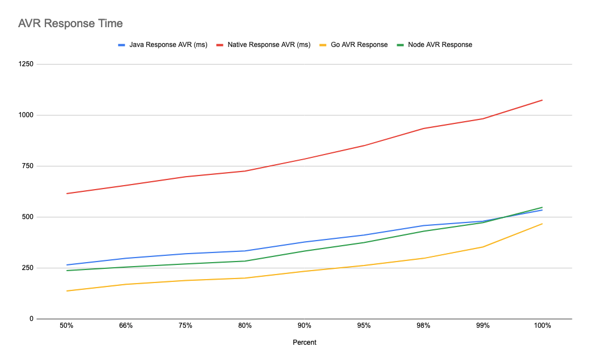
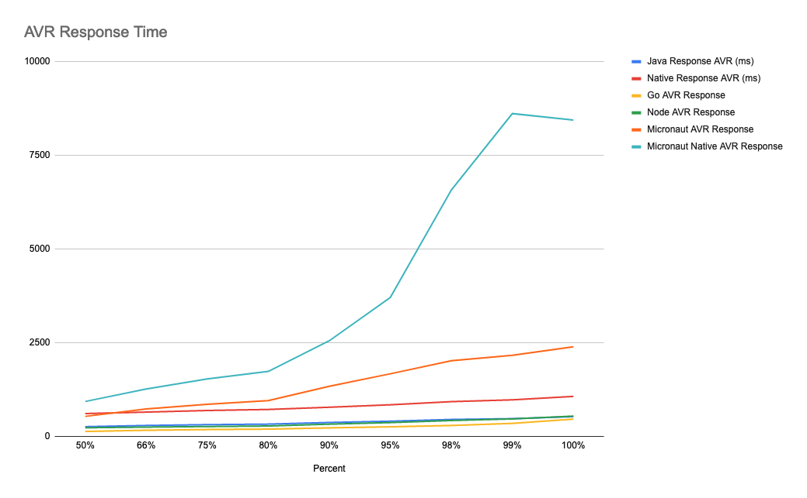
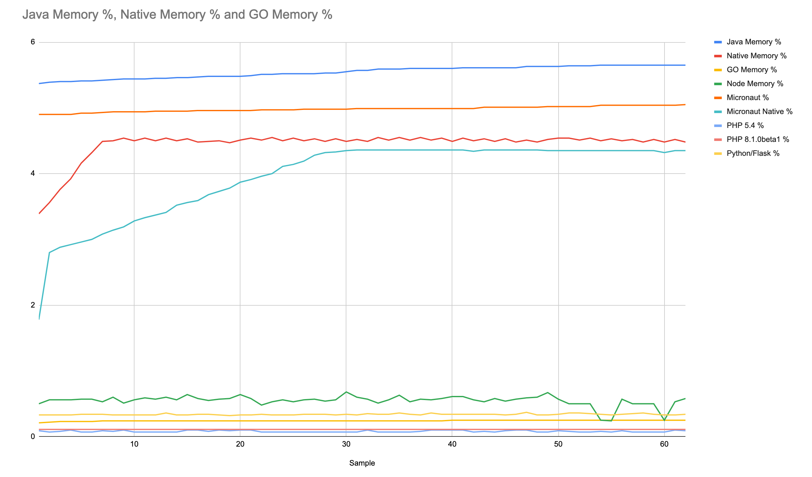
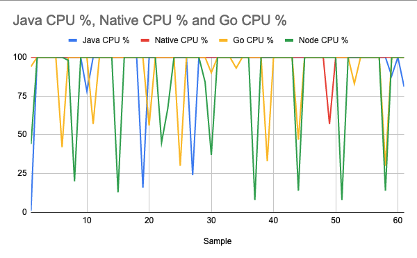

# Spring WebFlux

Why was Spring WebFlux created?

Part of the answer is the need for a non-blocking web stack to handle concurrency 
with a small number of threads and scale with fewer hardware resources.

**How to Compile**

You can compile the project only by running the `mvnw` command line script.

On *nix environment you may run the `mvnw` shell script,
```bash
./mvnw clean install
```

On Windows environment you may run the `mvnw.cmd` command.
```bash
mvnw.cmd clean install
```

**How to Native Compile**

You can compile this Spring WebFlux application to a native executable.

In order compile to native executable, you need to install the Graalvm and `native-image` command.

You can use SdkMan to install and configure JDKs.

```
# install sdkman
curl -s "https://get.sdkman.io" | bash

# initialize sdkman on the current shell session
source "$HOME/.sdkman/bin/sdkman-init.sh"

# install Graalvm Java 11
sdk install java 21.1.0.r11-grl

# install native image tool
gu install native-image
```

This command will create a native executable under the `target` folder.
```
mvn -Pnative -DskipTests package
```

**How to Run**

You'll need a PostgreSQL instance with some data in it. You can use the `postgres-docker-compose.yml` file under the `docker-compose` folder.

First you need to run the docker-compose on the `postgres-docker-compose.yml` file, it should create a PostgreSQL instance with the necessary `city` table and data. 

```
cd ../docker-compose
docker-compose -f postgres-docker-compose.yml up
```

## Test Results

The following are the measurements on memory, cpu and avarage response times for `project-webflux` as Java and Native compiled Java application with the `go-postgresql-rest` application as the Go application, `express-js` as the Node app, `micronaut-rest-r2db` as the Micronaut app.

The average startup time for the Java application is 2.5 seconds, after compiling to native the average is around 90ms, similar to the Go application.

Here is the `ab` command used in the test, first 1000 requests are discarded.
```
for i in {1..100}; do ab -n 500 -c 20 "http://localhost:8080/city" ; sleep 1; done
```

### The Average Response Times
Java, Native compiled Java and Go application results.
| Percent | Java Response AVR (ms) | Native Response AVR (ms) | Go AVR Response | Node AVR Response | Micronaut AVR Response | Micronaut Native AVR Response |
| ------- | ---------------------- | ------------------------ | --------------- | ----------------- | ---------------------- | ----------------------------- |
| 50%     | 265.75                 | 615.5                    | 138.25          | 237.75            | 540.75                 | 938                           |
| 66%     | 298.25                 | 655.25                   | 171             | 255.25            | 738.5                  | 1269.5                        |
| 75%     | 320.5                  | 697.75                   | 189.75          | 270.25            | 865.75                 | 1537.75                       |
| 80%     | 334.25                 | 725.5                    | 201             | 284.25            | 962.75                 | 1739.25                       |
| 90%     | 378.25                 | 784.75                   | 234.75          | 333.75            | 1344.25                | 2557                          |
| 95%     | 412.25                 | 850                      | 262.75          | 375.5             | 1676.75                | 3714.25                       |
| 98%     | 458.25                 | 934                      | 298             | 430.75            | 2023                   | 6578.75                       |
| 99%     | 480.25                 | 982                      | 354             | 473               | 2168.5                 | 8616.75                       |
| 100%    | 534.5                  | 1073.5                   | 467.75          | 547.75            | 2398                   | 8441.75                       |


### Average Response Time(s)

Without Micronaut.



With Micronaut.



### The Memory Percentages
Java, Native compiled Java and Go application results.
These values are of 16GB of memory, therefore;
* 5,5 percent approximately equals to **900MB** (Java Spring WebFlux)
* 4,5 percent approximately equals to **737MB** (Native compiled Spring WebFlux)
* 0.25 percent approximately equals to **40MB** (Go App)
* 0.55 percent approximately equals to **90MB** (Node App)
* 5 percent approximately equals to **820MB** (Micronaut Java)
* 4 percent approximately equals to **655MB** (Micronaut Native)

| Java Memory % | Native Memory % | GO Memory % | Node Memory % | Micronaut % | Micronaut Native % |
| ------------- | --------------- | ----------- | ------------- | ----------- | ------------------ |
| 5.37          | 3.39            | 0.21        | 0.5           | 4.9         | 1.78               |
| 5.39          | 3.56            | 0.22        | 0.56          | 4.9         | 2.8                |
| 5.4           | 3.76            | 0.23        | 0.56          | 4.9         | 2.88               |
| 5.4           | 3.92            | 0.23        | 0.56          | 4.9         | 2.92               |
| 5.41          | 4.16            | 0.23        | 0.57          | 4.92        | 2.96               |
| 5.41          | 4.32            | 0.23        | 0.57          | 4.92        | 3                  |
| 5.42          | 4.49            | 0.24        | 0.53          | 4.93        | 3.08               |
| 5.43          | 4.5             | 0.24        | 0.6           | 4.94        | 3.14               |
| 5.44          | 4.54            | 0.24        | 0.51          | 4.94        | 3.19               |
| 5.44          | 4.5             | 0.24        | 0.56          | 4.94        | 3.28               |
| 5.44          | 4.54            | 0.24        | 0.59          | 4.94        | 3.33               |
| 5.45          | 4.5             | 0.24        | 0.57          | 4.95        | 3.37               |
| 5.45          | 4.54            | 0.24        | 0.6           | 4.95        | 3.41               |
| 5.46          | 4.5             | 0.24        | 0.56          | 4.95        | 3.52               |
| 5.46          | 4.53            | 0.24        | 0.64          | 4.95        | 3.56               |
| 5.47          | 4.48            | 0.24        | 0.58          | 4.96        | 3.59               |
| 5.48          | 4.49            | 0.24        | 0.55          | 4.96        | 3.68               |
| 5.48          | 4.5             | 0.24        | 0.57          | 4.96        | 3.73               |
| 5.48          | 4.47            | 0.24        | 0.58          | 4.96        | 3.78               |
| 5.48          | 4.51            | 0.24        | 0.64          | 4.96        | 3.87               |
| 5.49          | 4.54            | 0.24        | 0.58          | 4.96        | 3.91               |
| 5.51          | 4.51            | 0.24        | 0.48          | 4.97        | 3.96               |
| 5.51          | 4.55            | 0.24        | 0.53          | 4.97        | 4                  |
| 5.52          | 4.5             | 0.24        | 0.56          | 4.97        | 4.11               |
| 5.52          | 4.54            | 0.24        | 0.53          | 4.97        | 4.14               |
| 5.52          | 4.5             | 0.24        | 0.56          | 4.98        | 4.19               |
| 5.52          | 4.53            | 0.24        | 0.57          | 4.98        | 4.28               |
| 5.53          | 4.49            | 0.24        | 0.54          | 4.98        | 4.32               |
| 5.53          | 4.53            | 0.24        | 0.56          | 4.98        | 4.33               |
| 5.55          | 4.49            | 0.24        | 0.68          | 4.98        | 4.35               |
| 5.57          | 4.52            | 0.24        | 0.6           | 4.99        | 4.36               |
| 5.57          | 4.49            | 0.24        | 0.57          | 4.99        | 4.36               |
| 5.59          | 4.55            | 0.24        | 0.51          | 4.99        | 4.36               |
| 5.59          | 4.51            | 0.24        | 0.56          | 4.99        | 4.36               |
| 5.59          | 4.55            | 0.24        | 0.63          | 4.99        | 4.36               |
| 5.6           | 4.51            | 0.24        | 0.53          | 4.99        | 4.36               |
| 5.6           | 4.55            | 0.24        | 0.57          | 4.99        | 4.36               |
| 5.6           | 4.51            | 0.24        | 0.56          | 4.99        | 4.36               |
| 5.6           | 4.54            | 0.24        | 0.58          | 4.99        | 4.36               |
| 5.6           | 4.49            | 0.25        | 0.61          | 4.99        | 4.36               |
| 5.61          | 4.54            | 0.25        | 0.61          | 4.99        | 4.36               |
| 5.61          | 4.5             | 0.25        | 0.56          | 4.99        | 4.34               |
| 5.61          | 4.53            | 0.25        | 0.53          | 5.01        | 4.36               |
| 5.61          | 4.49            | 0.25        | 0.58          | 5.01        | 4.36               |
| 5.61          | 4.53            | 0.25        | 0.54          | 5.01        | 4.36               |
| 5.61          | 4.48            | 0.25        | 0.57          | 5.01        | 4.36               |
| 5.63          | 4.51            | 0.25        | 0.59          | 5.01        | 4.36               |
| 5.63          | 4.48            | 0.25        | 0.6           | 5.01        | 4.36               |
| 5.63          | 4.52            | 0.25        | 0.67          | 5.02        | 4.35               |
| 5.63          | 4.54            | 0.25        | 0.57          | 5.02        | 4.35               |
| 5.64          | 4.54            | 0.25        | 0.5           | 5.02        | 4.35               |
| 5.64          | 4.51            | 0.25        | 0.5           | 5.02        | 4.35               |
| 5.64          | 4.54            | 0.25        | 0.5           | 5.02        | 4.35               |
| 5.65          | 4.5             | 0.25        | 0.25          | 5.04        | 4.35               |
| 5.65          | 4.53            | 0.25        | 0.24          | 5.04        | 4.35               |
| 5.65          | 4.5             | 0.25        | 0.57          | 5.04        | 4.35               |
| 5.65          | 4.52            | 0.25        | 0.5           | 5.04        | 4.35               |
| 5.65          | 4.48            | 0.25        | 0.5           | 5.04        | 4.35               |
| 5.65          | 4.52            | 0.25        | 0.5           | 5.04        | 4.35               |
| 5.65          | 4.48            | 0.25        | 0.25          | 5.04        | 4.32               |
| 5.65          | 4.52            | 0.25        | 0.53          | 5.04        | 4.35               |
| 5.65          | 4.48            | 0.25        | 0.58          | 5.05        | 4.35               |




### The CPU Percentages
Java, Native compiled Java and Go application results.

| Java CPU % | Native CPU % | Go CPU % | Node CPU % | Micronaut CPU % | Micronaut Native CPU % |
| ---------- | ------------ | -------- | ---------- | --------------- | ---------------------- |
| 1          | 100          | 94       | 44         | 100             | 5                      |
| 100        | 100          | 100      | 100        | 100             | 22                     |
| 100        | 100          | 100      | 100        | 100             | 76                     |
| 100        | 100          | 100      | 100        | 100             | 100                    |
| 100        | 100          | 100      | 100        | 100             | 100                    |
| 100        | 100          | 42       | 100        | 100             | 100                    |
| 100        | 100          | 100      | 98         | 100             | 100                    |
| 100        | 100          | 100      | 20         | 100             | 100                    |
| 100        | 100          | 100      | 100        | 100             | 100                    |
| 78         | 100          | 100      | 100        | 100             | 100                    |
| 100        | 100          | 57       | 100        | 100             | 100                    |
| 100        | 100          | 100      | 100        | 100             | 100                    |
| 100        | 100          | 100      | 100        | 100             | 100                    |
| 100        | 100          | 100      | 100        | 100             | 100                    |
| 100        | 100          | 100      | 13         | 100             | 100                    |
| 100        | 100          | 100      | 100        | 100             | 100                    |
| 100        | 100          | 100      | 100        | 100             | 100                    |
| 100        | 100          | 100      | 100        | 100             | 100                    |
| 16         | 100          | 100      | 100        | 100             | 100                    |
| 100        | 100          | 56       | 100        | 100             | 100                    |
| 100        | 100          | 100      | 100        | 100             | 100                    |
| 100        | 100          | 100      | 45         | 100             | 100                    |
| 100        | 100          | 100      | 67         | 100             | 100                    |
| 100        | 100          | 100      | 100        | 100             | 100                    |
| 100        | 100          | 30       | 100        | 100             | 100                    |
| 100        | 100          | 100      | 100        | 100             | 100                    |
| 24         | 100          | 100      | 100        | 100             | 100                    |
| 100        | 100          | 100      | 100        | 100             | 100                    |
| 100        | 100          | 100      | 84         | 100             | 100                    |
| 100        | 100          | 90       | 37         | 100             | 100                    |
| 100        | 100          | 100      | 100        | 100             | 100                    |
| 100        | 100          | 100      | 100        | 100             | 100                    |
| 100        | 100          | 100      | 100        | 100             | 100                    |
| 100        | 100          | 93       | 100        | 100             | 100                    |
| 100        | 100          | 100      | 100        | 100             | 100                    |
| 100        | 100          | 100      | 100        | 100             | 100                    |
| 100        | 100          | 100      | 8          | 37              | 100                    |
| 100        | 100          | 100      | 100        | 100             | 100                    |
| 100        | 100          | 33       | 100        | 100             | 57                     |
| 100        | 100          | 100      | 100        | 100             | 100                    |
| 100        | 100          | 100      | 100        | 100             | 100                    |
| 100        | 100          | 100      | 100        | 100             | 100                    |
| 100        | 100          | 100      | 100        | 100             | 100                    |
| 100        | 100          | 47       | 14         | 100             | 100                    |
| 100        | 100          | 100      | 100        | 100             | 100                    |
| 100        | 100          | 100      | 100        | 100             | 100                    |
| 100        | 100          | 100      | 100        | 100             | 100                    |
| 100        | 100          | 100      | 100        | 100             | 100                    |
| 100        | 57           | 100      | 100        | 100             | 100                    |
| 100        | 100          | 100      | 100        | 100             | 100                    |
| 100        | 100          | 100      | 8          | 100             | 100                    |
| 100        | 100          | 100      | 100        | 100             | 100                    |
| 100        | 100          | 83       | 100        | 100             | 100                    |
| 100        | 100          | 100      | 100        | 100             | 100                    |
| 100        | 100          | 100      | 100        | 51              | 100                    |
| 100        | 100          | 100      | 100        | 100             | 100                    |
| 100        | 100          | 100      | 100        | 100             | 100                    |
| 100        | 100          | 30       | 14         | 100             | 100                    |
| 88         | 100          | 100      | 100        | 100             | 100                    |
| 100        | 100          | 100      | 100        | 100             | 100                    |
| 81         | 100          | 100      | 100        | 100             | 100                    |




