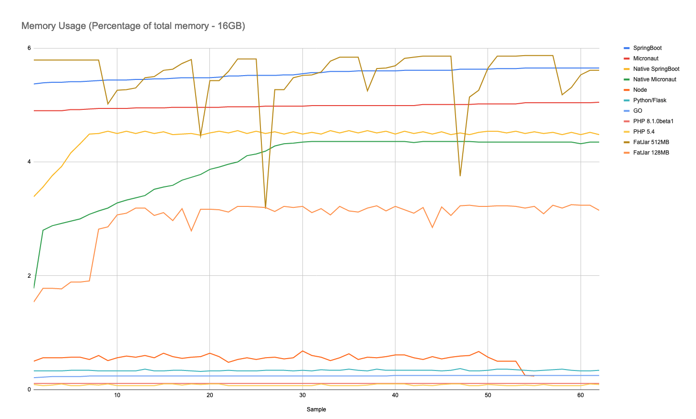
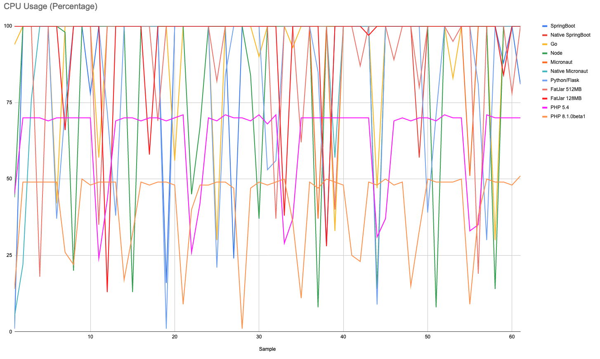

# Spring WebFlux

Why was Spring WebFlux created?

Part of the answer is the need for a non-blocking web stack to handle concurrency 
with a small number of threads and scale with fewer hardware resources.

**How to Compile**

You can compile the project only by running the `mvnw` command line script.

On *nix environment you may run the `mvnw` shell script,
```bash
./mvnw clean install
```

On Windows environment you may run the `mvnw.cmd` command.
```bash
mvnw.cmd clean install
```

**How to Native Compile**

You can compile this Spring WebFlux application to a native executable.

In order compile to native executable, you need to install the Graalvm and `native-image` command.

You can use SdkMan to install and configure JDKs.

```
# install sdkman
curl -s "https://get.sdkman.io" | bash

# initialize sdkman on the current shell session
source "$HOME/.sdkman/bin/sdkman-init.sh"

# install Graalvm Java 11
sdk install java 21.1.0.r11-grl

# install native image tool
gu install native-image
```

This command will create a native executable under the `target` folder.
```
mvn -Pnative -DskipTests package
```

**How to Run**

You'll need a PostgreSQL instance with some data in it. You can use the `postgres-docker-compose.yml` file under the `docker-compose` folder.

First you need to run the docker-compose on the `postgres-docker-compose.yml` file, it should create a PostgreSQL instance with the necessary `city` table and data. 

```
cd ../docker-compose
docker-compose -f postgres-docker-compose.yml up
```

## Test Results

The following are the measurements on memory, cpu and avarage response times for `project-webflux` as Java and Native compiled Java application with the `go-postgresql-rest` application as the Go application, `express-js` as the Node app, `micronaut-rest-r2db` as the Micronaut app, `php-pg-rest` as the PHP app, `python-pg-rest` as the python app.

The average startup time for the Java application is 2.5 seconds, after compiling to native the average is around 90ms, similar to the Go application.

Here is the `ab` command used in the test, first 1000 requests are discarded.
```
for i in {1..100}; do ab -n 500 -c 20 "http://localhost:8080/city" ; sleep 1; done
```

### The Average Response Times
Java, Native compiled Java and other results.

| Percent | Java Response AVR (ms) | Native Response AVR (ms) | Go AVR Response | Node AVR Response | Micronaut AVR Response | Micronaut Native AVR Response | PHP 5.4 AVR | PHP 8.1.0beta1 AVR | Python/Flask AVR |
| ------- | ---------------------- | ------------------------ | --------------- | ----------------- | ---------------------- | ----------------------------- | ----------- | ------------------ | ---------------- |
| 50%     | 265.75                 | 615.5                    | 138.25          | 237.75            | 540.75                 | 938                           | 399.75      | 231.5              | 211.5            |
| 66%     | 298.25                 | 655.25                   | 171             | 255.25            | 738.5                  | 1269.5                        | 400.25      | 233.25             | 226.75           |
| 75%     | 320.5                  | 697.75                   | 189.75          | 270.25            | 865.75                 | 1537.75                       | 401.25      | 234                | 235.75           |
| 80%     | 334.25                 | 725.5                    | 201             | 284.25            | 962.75                 | 1739.25                       | 401.5       | 234.25             | 241.5            |
| 90%     | 378.25                 | 784.75                   | 234.75          | 333.75            | 1344.25                | 2557                          | 403         | 235.75             | 264.75           |
| 95%     | 412.25                 | 850                      | 262.75          | 375.5             | 1676.75                | 3714.25                       | 404.5       | 237.25             | 305.5            |
| 98%     | 458.25                 | 934                      | 298             | 430.75            | 2023                   | 6578.75                       | 406.75      | 239.5              | 337.5            |
| 99%     | 480.25                 | 982                      | 354             | 473               | 2168.5                 | 8616.75                       | 409         | 239.75             | 358              |
| 100%    | 534.5                  | 1073.5                   | 467.75          | 547.75            | 2398                   | 8441.75                       | 410.25      | 240.5              | 408.5            |


### Average Response Time(s)

Without Micronaut.


With Micronaut.


### The Memory Percentages
Java, Native compiled Java and other application results.
These values are of 16GB of memory, therefore;
* 5,5 percent approximately equals to **900MB** (Java Spring WebFlux)
* 4,5 percent approximately equals to **737MB** (Native compiled Spring WebFlux)
* 0.25 percent approximately equals to **40MB** (Go App)
* 0.55 percent approximately equals to **90MB** (Node App)
* 5 percent approximately equals to **820MB** (Micronaut Java)
* 4 percent approximately equals to **655MB** (Micronaut Native)
* 0.08 percent approximately equals to **13MB** (PHP 5.4)
* 0.11 percent approximately equals to **18MB** (PHP 8.1.0beta1)
* 0,34 percent approximately equals to **56MB** (Python)

| Sample | Java Memory % | Native Memory % | GO Memory % | Node Memory % | Micronaut % | Micronaut Native % | PHP 5.4 % | PHP 8.1.0beta1 % | Python/Flask % |
| ------ | ------------- | --------------- | ----------- | ------------- | ----------- | ------------------ | --------- | ---------------- | -------------- |
| 1      | 5.37          | 3.39            | 0.21        | 0.5           | 4.9         | 1.78               | 0.09      | 0.11             | 0.33           |
| 2      | 5.39          | 3.56            | 0.22        | 0.56          | 4.9         | 2.8                | 0.07      | 0.11             | 0.33           |
| 3      | 5.4           | 3.76            | 0.23        | 0.56          | 4.9         | 2.88               | 0.08      | 0.11             | 0.33           |
| 4      | 5.4           | 3.92            | 0.23        | 0.56          | 4.9         | 2.92               | 0.1       | 0.11             | 0.33           |
| 5      | 5.41          | 4.16            | 0.23        | 0.57          | 4.92        | 2.96               | 0.07      | 0.11             | 0.34           |
| 6      | 5.41          | 4.32            | 0.23        | 0.57          | 4.92        | 3                  | 0.07      | 0.11             | 0.34           |
| 7      | 5.42          | 4.49            | 0.24        | 0.53          | 4.93        | 3.08               | 0.09      | 0.11             | 0.34           |
| 8      | 5.43          | 4.5             | 0.24        | 0.6           | 4.94        | 3.14               | 0.08      | 0.11             | 0.33           |
| 9      | 5.44          | 4.54            | 0.24        | 0.51          | 4.94        | 3.19               | 0.1       | 0.11             | 0.33           |
| 10     | 5.44          | 4.5             | 0.24        | 0.56          | 4.94        | 3.28               | 0.07      | 0.11             | 0.33           |
| 11     | 5.44          | 4.54            | 0.24        | 0.59          | 4.94        | 3.33               | 0.07      | 0.11             | 0.33           |
| 12     | 5.45          | 4.5             | 0.24        | 0.57          | 4.95        | 3.37               | 0.07      | 0.11             | 0.33           |
| 13     | 5.45          | 4.54            | 0.24        | 0.6           | 4.95        | 3.41               | 0.07      | 0.11             | 0.36           |
| 14     | 5.46          | 4.5             | 0.24        | 0.56          | 4.95        | 3.52               | 0.07      | 0.11             | 0.33           |
| 15     | 5.46          | 4.53            | 0.24        | 0.64          | 4.95        | 3.56               | 0.1       | 0.11             | 0.33           |
| 16     | 5.47          | 4.48            | 0.24        | 0.58          | 4.96        | 3.59               | 0.1       | 0.11             | 0.34           |
| 17     | 5.48          | 4.49            | 0.24        | 0.55          | 4.96        | 3.68               | 0.08      | 0.11             | 0.34           |
| 18     | 5.48          | 4.5             | 0.24        | 0.57          | 4.96        | 3.73               | 0.1       | 0.11             | 0.33           |
| 19     | 5.48          | 4.47            | 0.24        | 0.58          | 4.96        | 3.78               | 0.09      | 0.11             | 0.32           |
| 20     | 5.48          | 4.51            | 0.24        | 0.64          | 4.96        | 3.87               | 0.1       | 0.11             | 0.33           |
| 21     | 5.49          | 4.54            | 0.24        | 0.58          | 4.96        | 3.91               | 0.1       | 0.11             | 0.33           |
| 22     | 5.51          | 4.51            | 0.24        | 0.48          | 4.97        | 3.96               | 0.07      | 0.11             | 0.34           |
| 23     | 5.51          | 4.55            | 0.24        | 0.53          | 4.97        | 4                  | 0.07      | 0.11             | 0.33           |
| 24     | 5.52          | 4.5             | 0.24        | 0.56          | 4.97        | 4.11               | 0.07      | 0.11             | 0.33           |
| 25     | 5.52          | 4.54            | 0.24        | 0.53          | 4.97        | 4.14               | 0.07      | 0.11             | 0.33           |
| 26     | 5.52          | 4.5             | 0.24        | 0.56          | 4.98        | 4.19               | 0.07      | 0.11             | 0.34           |
| 27     | 5.52          | 4.53            | 0.24        | 0.57          | 4.98        | 4.28               | 0.07      | 0.11             | 0.34           |
| 28     | 5.53          | 4.49            | 0.24        | 0.54          | 4.98        | 4.32               | 0.07      | 0.11             | 0.34           |
| 29     | 5.53          | 4.53            | 0.24        | 0.56          | 4.98        | 4.33               | 0.07      | 0.11             | 0.33           |
| 30     | 5.55          | 4.49            | 0.24        | 0.68          | 4.98        | 4.35               | 0.07      | 0.11             | 0.34           |
| 31     | 5.57          | 4.52            | 0.24        | 0.6           | 4.99        | 4.36               | 0.07      | 0.11             | 0.33           |
| 32     | 5.57          | 4.49            | 0.24        | 0.57          | 4.99        | 4.36               | 0.1       | 0.11             | 0.35           |
| 33     | 5.59          | 4.55            | 0.24        | 0.51          | 4.99        | 4.36               | 0.07      | 0.11             | 0.34           |
| 34     | 5.59          | 4.51            | 0.24        | 0.56          | 4.99        | 4.36               | 0.07      | 0.11             | 0.34           |
| 35     | 5.59          | 4.55            | 0.24        | 0.63          | 4.99        | 4.36               | 0.07      | 0.11             | 0.36           |
| 36     | 5.6           | 4.51            | 0.24        | 0.53          | 4.99        | 4.36               | 0.07      | 0.11             | 0.34           |
| 37     | 5.6           | 4.55            | 0.24        | 0.57          | 4.99        | 4.36               | 0.08      | 0.11             | 0.33           |
| 38     | 5.6           | 4.51            | 0.24        | 0.56          | 4.99        | 4.36               | 0.1       | 0.11             | 0.36           |
| 39     | 5.6           | 4.54            | 0.24        | 0.58          | 4.99        | 4.36               | 0.1       | 0.11             | 0.34           |
| 40     | 5.6           | 4.49            | 0.25        | 0.61          | 4.99        | 4.36               | 0.1       | 0.11             | 0.34           |
| 41     | 5.61          | 4.54            | 0.25        | 0.61          | 4.99        | 4.36               | 0.1       | 0.11             | 0.34           |
| 42     | 5.61          | 4.5             | 0.25        | 0.56          | 4.99        | 4.34               | 0.07      | 0.11             | 0.34           |
| 43     | 5.61          | 4.53            | 0.25        | 0.53          | 5.01        | 4.36               | 0.08      | 0.11             | 0.34           |
| 44     | 5.61          | 4.49            | 0.25        | 0.58          | 5.01        | 4.36               | 0.07      | 0.11             | 0.34           |
| 45     | 5.61          | 4.53            | 0.25        | 0.54          | 5.01        | 4.36               | 0.09      | 0.11             | 0.33           |
| 46     | 5.61          | 4.48            | 0.25        | 0.57          | 5.01        | 4.36               | 0.1       | 0.11             | 0.34           |
| 47     | 5.63          | 4.51            | 0.25        | 0.59          | 5.01        | 4.36               | 0.1       | 0.11             | 0.37           |
| 48     | 5.63          | 4.48            | 0.25        | 0.6           | 5.01        | 4.36               | 0.07      | 0.11             | 0.33           |
| 49     | 5.63          | 4.52            | 0.25        | 0.67          | 5.02        | 4.35               | 0.07      | 0.11             | 0.33           |
| 50     | 5.63          | 4.54            | 0.25        | 0.57          | 5.02        | 4.35               | 0.09      | 0.11             | 0.34           |
| 51     | 5.64          | 4.54            | 0.25        | 0.5           | 5.02        | 4.35               | 0.08      | 0.11             | 0.36           |
| 52     | 5.64          | 4.51            | 0.25        | 0.5           | 5.02        | 4.35               | 0.07      | 0.11             | 0.36           |
| 53     | 5.64          | 4.54            | 0.25        | 0.5           | 5.02        | 4.35               | 0.07      | 0.11             | 0.35           |
| 54     | 5.65          | 4.5             | 0.25        | 0.25          | 5.04        | 4.35               | 0.08      | 0.11             | 0.34           |
| 55     | 5.65          | 4.53            | 0.25        | 0.24          | 5.04        | 4.35               | 0.07      | 0.11             | 0.33           |
| 56     | 5.65          | 4.5             | 0.25        | 0.57          | 5.04        | 4.35               | 0.09      | 0.11             | 0.34           |
| 57     | 5.65          | 4.52            | 0.25        | 0.5           | 5.04        | 4.35               | 0.07      | 0.11             | 0.35           |
| 58     | 5.65          | 4.48            | 0.25        | 0.5           | 5.04        | 4.35               | 0.07      | 0.11             | 0.36           |
| 59     | 5.65          | 4.52            | 0.25        | 0.5           | 5.04        | 4.35               | 0.07      | 0.11             | 0.34           |
| 60     | 5.65          | 4.48            | 0.25        | 0.25          | 5.04        | 4.32               | 0.07      | 0.11             | 0.33           |
| 61     | 5.65          | 4.52            | 0.25        | 0.53          | 5.04        | 4.35               | 0.1       | 0.11             | 0.33           |
| 62     | 5.65          | 4.48            | 0.25        | 0.58          | 5.05        | 4.35               | 0.09      | 0.11             | 0.34           |




### The CPU Percentages
Java, Native compiled Java and other application results.

| Sample | Java CPU % | Native CPU % | Go CPU % | Node CPU % | Micronaut CPU % | Micronaut Native CPU % | PHP 5.4 CPU % | PHP 8.1.0beta1 CPU % | Python/Flask CPU % |
| ------ | ---------- | ------------ | -------- | ---------- | --------------- | ---------------------- | ------------- | -------------------- | ------------------ |
| 1      | 1          | 100          | 94       | 44         | 100             | 5                      | 45            | 14                   | 100                |
| 2      | 100        | 100          | 100      | 100        | 100             | 22                     | 70            | 49                   | 100                |
| 3      | 100        | 100          | 100      | 100        | 100             | 76                     | 70            | 49                   | 100                |
| 4      | 100        | 100          | 100      | 100        | 100             | 100                    | 70            | 49                   | 100                |
| 5      | 100        | 100          | 100      | 100        | 100             | 100                    | 69            | 49                   | 100                |
| 6      | 100        | 100          | 42       | 100        | 100             | 100                    | 70            | 49                   | 37                 |
| 7      | 100        | 100          | 100      | 98         | 100             | 100                    | 70            | 26                   | 73                 |
| 8      | 100        | 100          | 100      | 20         | 100             | 100                    | 70            | 22                   | 100                |
| 9      | 100        | 100          | 100      | 100        | 100             | 100                    | 70            | 50                   | 100                |
| 10     | 78         | 100          | 100      | 100        | 100             | 100                    | 70            | 48                   | 100                |
| 11     | 100        | 100          | 57       | 100        | 100             | 100                    | 24            | 49                   | 100                |
| 12     | 100        | 100          | 100      | 100        | 100             | 100                    | 43            | 49                   | 72                 |
| 13     | 100        | 100          | 100      | 100        | 100             | 100                    | 69            | 49                   | 38                 |
| 14     | 100        | 100          | 100      | 100        | 100             | 100                    | 70            | 17                   | 100                |
| 15     | 100        | 100          | 100      | 13         | 100             | 100                    | 70            | 32                   | 100                |
| 16     | 100        | 100          | 100      | 100        | 100             | 100                    | 69            | 49                   | 100                |
| 17     | 100        | 100          | 100      | 100        | 100             | 100                    | 70            | 48                   | 100                |
| 18     | 100        | 100          | 100      | 100        | 100             | 100                    | 70            | 49                   | 100                |
| 19     | 16         | 100          | 100      | 100        | 100             | 100                    | 69            | 49                   | 1                  |
| 20     | 100        | 100          | 56       | 100        | 100             | 100                    | 70            | 48                   | 100                |
| 21     | 100        | 100          | 100      | 100        | 100             | 100                    | 71            | 9                    | 100                |
| 22     | 100        | 100          | 100      | 45         | 100             | 100                    | 26            | 40                   | 100                |
| 23     | 100        | 100          | 100      | 67         | 100             | 100                    | 42            | 48                   | 100                |
| 24     | 100        | 100          | 100      | 100        | 100             | 100                    | 70            | 48                   | 100                |
| 25     | 100        | 100          | 30       | 100        | 100             | 100                    | 69            | 49                   | 21                 |
| 26     | 100        | 100          | 100      | 100        | 100             | 100                    | 71            | 49                   | 84                 |
| 27     | 24         | 100          | 100      | 100        | 100             | 100                    | 70            | 47                   | 100                |
| 28     | 100        | 100          | 100      | 100        | 100             | 100                    | 70            | 1                    | 100                |
| 29     | 100        | 100          | 100      | 84         | 100             | 100                    | 69            | 47                   | 100                |
| 30     | 100        | 100          | 90       | 37         | 100             | 100                    | 71            | 49                   | 100                |
| 31     | 100        | 100          | 100      | 100        | 100             | 100                    | 68            | 48                   | 53                 |
| 32     | 100        | 100          | 100      | 100        | 100             | 100                    | 71            | 49                   | 56                 |
| 33     | 100        | 100          | 100      | 100        | 100             | 100                    | 29            | 50                   | 100                |
| 34     | 100        | 100          | 93       | 100        | 100             | 100                    | 37            | 36                   | 100                |
| 35     | 100        | 100          | 100      | 100        | 100             | 100                    | 70            | 11                   | 100                |
| 36     | 100        | 100          | 100      | 100        | 100             | 100                    | 70            | 49                   | 100                |
| 37     | 100        | 100          | 100      | 8          | 37              | 100                    | 70            | 47                   | 85                 |
| 38     | 100        | 100          | 100      | 100        | 100             | 100                    | 70            | 50                   | 28                 |
| 39     | 100        | 100          | 33       | 100        | 100             | 57                     | 70            | 49                   | 100                |
| 40     | 100        | 100          | 100      | 100        | 100             | 100                    | 70            | 48                   | 100                |
| 41     | 100        | 100          | 100      | 100        | 100             | 100                    | 70            | 25                   | 100                |
| 42     | 100        | 100          | 100      | 100        | 100             | 100                    | 70            | 23                   | 100                |
| 43     | 100        | 100          | 100      | 100        | 100             | 100                    | 70            | 49                   | 100                |
| 44     | 100        | 100          | 47       | 14         | 100             | 100                    | 31            | 48                   | 8.91               |
| 45     | 100        | 100          | 100      | 100        | 100             | 100                    | 37            | 50                   | 100                |
| 46     | 100        | 100          | 100      | 100        | 100             | 100                    | 69            | 48                   | 100                |
| 47     | 100        | 100          | 100      | 100        | 100             | 100                    | 70            | 49                   | 100                |
| 48     | 100        | 100          | 100      | 100        | 100             | 100                    | 69            | 15                   | 100                |
| 49     | 100        | 57           | 100      | 100        | 100             | 100                    | 70            | 33                   | 100                |
| 50     | 100        | 100          | 100      | 100        | 100             | 100                    | 70            | 50                   | 39                 |
| 51     | 100        | 100          | 100      | 8          | 100             | 100                    | 69            | 49                   | 71                 |
| 52     | 100        | 100          | 100      | 100        | 100             | 100                    | 71            | 49                   | 100                |
| 53     | 100        | 100          | 83       | 100        | 100             | 100                    | 70            | 49                   | 100                |
| 54     | 100        | 100          | 100      | 100        | 100             | 100                    | 70            | 50                   | 100                |
| 55     | 100        | 100          | 100      | 100        | 51              | 100                    | 33            | 9                    | 100                |
| 56     | 100        | 100          | 100      | 100        | 100             | 100                    | 35            | 38                   | 81                 |
| 57     | 100        | 100          | 100      | 100        | 100             | 100                    | 71            | 50                   | 30                 |
| 58     | 100        | 100          | 30       | 14         | 100             | 100                    | 70            | 49                   | 100                |
| 59     | 88         | 100          | 100      | 100        | 100             | 100                    | 70            | 49                   | 100                |
| 60     | 100        | 100          | 100      | 100        | 100             | 100                    | 70            | 48                   | 100                |
| 61     | 81         | 100          | 100      | 100        | 100             | 100                    | 70            | 51                   | 100                |




